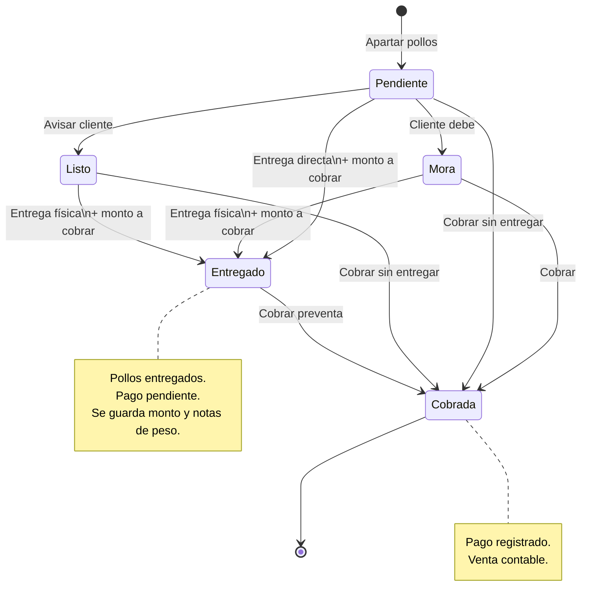
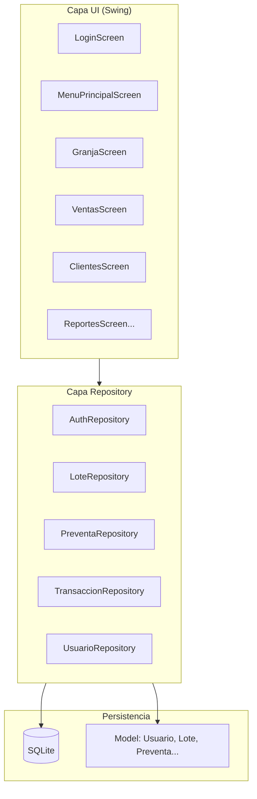
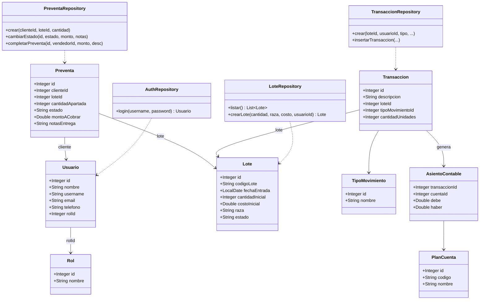

# El Buen Pollo — Sistema de gestión de lotes de engorde

**Asignatura:** Programación Orientada a Objetos (POO)  
**Taller #5**

---

## 1. Descripción del proyecto

En el marco de la asignatura de **Programación Orientada a Objetos**, este proyecto aplica conceptos de análisis, diseño orientado a objetos e implementación mediante el desarrollo de un **sistema de escritorio** para la gestión y control de lotes de pollos de engorde en una explotación de pequeña escala.

### Problemática

El control de gastos, mortalidad, preventas, ventas e ingresos suele realizarse de forma **manual o dispersa** (cuadernos, hojas sueltas, memoria del operador), lo que dificulta:

- Saber cuántos pollos quedan disponibles por lote.
- Llevar el seguimiento financiero de cada lote.
- Recordar qué clientes deben pagar y cuánto, después de la entrega.
- Consolidar reportes para la toma de decisiones.

### Solución propuesta

Una aplicación de escritorio (**Java Swing + SQLite**) que permite:

- Administrar múltiples lotes de pollos con **costo inicial de compra**.
- Registrar **gastos operativos** (alimento, medicinas) e **inversiones** (bebederos, equipos).
- Controlar **mortalidad** y **ventas**.
- Gestionar **preventas** con estados (pendiente, listo, mora, entregado, cobrada).
- Registrar **clientes** con teléfono y usuario de acceso.
- Visualizar **reportes operativos, financieros y contables**.

Toda la información económica se gestiona en **pesos colombianos (COP)**.

---

## 2. Actores y roles

| Rol | ID | Actor | Acceso principal |
|-----|----|--------|------------------|
| Administrador | 1 | Dueño / supervisor | Granja, Ventas, Clientes, reportes operativos, finanzas, saldos contables, historial |
| Granjero | 2 | Operario de granja | Módulo Granja |
| Vendedor | 3 | Personal de ventas | Módulo Ventas y Clientes |
| Cliente | 4 | Comprador | Solo datos en BD (preventas/ventas); no inicia sesión en menú operativo |

La autenticación se realiza con **username** y **contraseña**. El **nombre** identifica a la persona; el **teléfono** permite contactar al cliente.

---

## 3. Requisitos funcionales (corregidos según implementación)

### 3.1 Granjero

| ID | Requisito |
|----|-----------|
| RF-G01 | Registrar un nuevo lote (cantidad, raza, **costo total de compra**). |
| RF-G02 | Consultar listado de lotes con cantidad y costo. |
| RF-G03 | Registrar compras e insumos del lote (vitaminas, alimento, equipos). |
| RF-G04 | Registrar mortalidad u otros movimientos del lote. |
| RF-G05 | Consultar reporte detallado de lotes (días de vida, apartados, disponible). |
| RF-G06 | Consultar historial de movimientos de un lote seleccionado. |

### 3.2 Vendedor

| ID | Requisito |
|----|-----------|
| RF-V01 | Registrar **preventa** (apartar pollos a un cliente). |
| RF-V02 | Consultar listado de preventas con teléfono del cliente y monto pendiente. |
| RF-V03 | Cambiar **estado** de la preventa (pendiente, listo, mora, entregado). |
| RF-V04 | Al marcar **entregado**, registrar **monto a cobrar** y notas (peso, detalle). |
| RF-V05 | **Cobrar** preventa (registrar pago y venta contable). |
| RF-V06 | Registrar **venta directa** (sin preventa previa). |
| RF-V07 | Gestionar **clientes** (crear, editar, eliminar). |
| RF-V08 | Validar que no se vendan/aparten más pollos de los disponibles. |

### 3.3 Administrador

Incluye todo lo anterior más:

| ID | Requisito |
|----|-----------|
| RF-A01 | Consultar reporte operativo de lotes. |
| RF-A02 | Consultar **rentabilidad por lote** (ingresos, gastos, ganancia/pérdida). |
| RF-A03 | Consultar **saldos contables** (plan de cuentas, filtro por lote). |
| RF-A04 | Consultar **historial unificado** por lote (ventas, compras, preventas, muertes). |

---

## 4. Diagrama de casos de uso

> **Vista previa:** requiere extensión **Markdown Preview Mermaid Support** en VS Code/Cursor, o ver el archivo en GitHub.

### 4.1 Actores y casos de uso

```mermaid
flowchart TB
    subgraph Actores
        ADM[Administrador]
        GRN[Granjero]
        VND[Vendedor]
    end

    subgraph Autenticacion
        UC1((CU-01 Iniciar sesión))
    end

    subgraph Granja
        UC2((CU-02 Registrar lote))
        UC3((CU-03 Registrar egresos))
        UC4((CU-04 Registrar mortalidad))
        UC5((CU-05 Consultar lotes))
    end

    subgraph Ventas
        UC6((CU-06 Apartar preventa))
        UC7((CU-07 Cambiar estado))
        UC8((CU-08 Monto al entregar))
        UC9((CU-09 Cobrar preventa))
        UC10((CU-10 Venta directa))
        UC11((CU-11 Consultar preventas))
    end

    subgraph Clientes
        UC12((CU-12 Gestionar clientes))
    end

    subgraph Reportes
        UC13((CU-13 Reporte operativo))
        UC14((CU-14 Reporte financiero))
        UC15((CU-15 Saldos contables))
        UC16((CU-16 Historial por lote))
    end

    ADM --> UC1
    GRN --> UC1
    VND --> UC1

    GRN --> UC2
    GRN --> UC3
    GRN --> UC4
    GRN --> UC5

    VND --> UC6
    VND --> UC7
    VND --> UC8
    VND --> UC9
    VND --> UC10
    VND --> UC11
    VND --> UC12

    ADM --> UC2
    ADM --> UC5
    ADM --> UC11
    ADM --> UC12
    ADM --> UC13
    ADM --> UC14
    ADM --> UC15
    ADM --> UC16
```



### 4.2 Matriz actor × caso de uso

Leyenda: **X** = puede ejecutar | **(X)** = solo administrador (además de otros)

| Caso de uso | Admin | Granjero | Vendedor |
|-------------|:-----:|:--------:|:--------:|
| CU-01 Iniciar sesión | X | X | X |
| CU-02 Registrar lote | X | X | |
| CU-03 Registrar egreso / insumos | X | X | |
| CU-04 Registrar mortalidad | X | X | |
| CU-05 Consultar lotes | X | X | |
| CU-06 Apartar preventa | X | | X |
| CU-07 Cambiar estado preventa | X | | X |
| CU-08 Registrar monto al entregar | X | | X |
| CU-09 Cobrar preventa | X | | X |
| CU-10 Venta directa | X | | X |
| CU-11 Consultar preventas | X | | X |
| CU-12 Gestionar clientes | X | | X |
| CU-13 Reporte operativo lotes | (X) | | |
| CU-14 Reporte financiero | (X) | | |
| CU-15 Saldos contables | (X) | | |
| CU-16 Historial por lote | (X) | | |

### 4.3 Flujo de estados de una preventa



---
## 5. Casos de uso detallados

### CU-01: Iniciar sesión

| Campo | Descripción |
|-------|-------------|
| **Nombre** | Iniciar sesión |
| **Descripción** | Permite autenticarse con username y contraseña según el rol asignado. |
| **Actores** | Administrador, Granjero, Vendedor |
| **Precondición** | El usuario existe en la base de datos. |
| **Postcondición** | Se muestra el menú principal según el rol. |

**Escenario principal**

1. El usuario ingresa su **username**.
2. El usuario ingresa su **contraseña**.
3. El sistema valida credenciales contra la base de datos.
4. El sistema identifica el **rol** del usuario.
5. El sistema muestra el **menú principal** con las opciones permitidas.

**Flujo alternativo 3A — Credenciales inválidas**

1. El sistema muestra mensaje de error.
2. El sistema limpia la contraseña y solicita reintento.

---

### CU-02: Registrar lote

| Campo | Descripción |
|-------|-------------|
| **Nombre** | Registrar lote |
| **Descripción** | Registra un nuevo lote de pollos con costo inicial de compra. |
| **Actores** | Granjero, Administrador |
| **Precondición** | Sesión iniciada con rol autorizado. |
| **Postcondición** | Lote creado con código automático (ej. LT-003), transacción contable de compra. |

**Escenario principal**

1. El granjero abre **Módulo Granja**.
2. Ingresa **cantidad de pollos**, **costo total del lote (COP)** y **raza** (opcional).
3. Confirma **Crear lote**.
4. El sistema genera código de lote y fecha de entrada.
5. El sistema registra el **costo inicial** y un movimiento **COMPRA_LOTE** en contabilidad.
6. El sistema confirma la creación.

**Flujo alternativo 3A — Datos inválidos**

1. Cantidad ≤ 0 o costo ≤ 0.
2. El sistema muestra error y no crea el lote.

---

### CU-03: Registrar egreso / insumo del lote

| Campo | Descripción |
|-------|-------------|
| **Nombre** | Registrar egreso del lote |
| **Descripción** | Registra gastos operativos o inversiones en equipos. |
| **Actores** | Granjero, Administrador |
| **Precondición** | Existe al menos un lote. |
| **Postcondición** | Egreso asociado al lote con asiento contable. |

**Escenario principal**

1. Selecciona un lote en la tabla.
2. Abre **Compras e insumos**.
3. Elige tipo (vitaminas, alimento, bebedero, etc.), monto y descripción.
4. Confirma el registro.
5. El sistema valida monto > 0 y guarda la transacción.

**Flujo alternativo — Monto inválido**

1. El sistema rechaza valores vacíos o ≤ 0.

---

### CU-04: Registrar mortalidad

| Campo | Descripción |
|-------|-------------|
| **Nombre** | Registrar mortalidad |
| **Descripción** | Registra baja de pollos por muerte. |
| **Actores** | Granjero, Administrador |
| **Precondición** | Lote activo seleccionado. |
| **Postcondición** | Movimiento tipo MUERTE registrado; disponible del lote disminuye. |

**Escenario principal**

1. Selecciona lote → **Muertes / movimientos**.
2. Elige tipo **MUERTE**, cantidad y descripción.
3. Confirma registro.
4. El sistema actualiza el cálculo de pollos disponibles.

**Flujo alternativo — Cantidad inválida**

1. Cantidad ≤ 0 o superior a disponible → mensaje de error.

---

### CU-05: Consultar lotes

| Campo | Descripción |
|-------|-------------|
| **Nombre** | Consultar lotes |
| **Descripción** | Visualiza lotes con datos productivos y financieros básicos. |
| **Actores** | Granjero, Administrador |
| **Precondición** | Sesión iniciada. |
| **Postcondición** | Listado mostrado en pantalla. |

**Escenario principal**

1. Accede a Granja o **Reporte detallado**.
2. El sistema muestra: código, cantidad, costo, días de vida, apartados, **disponible para venta**.
3. El usuario consulta la información.

**Nota de diseño:** *Disponible* = inicial − ventas/muertes − preventas activas (pendiente, listo, mora). No resta compras ni entregas ya cobradas.

---

### CU-06: Apartar preventa

| Campo | Descripción |
|-------|-------------|
| **Nombre** | Apartar preventa |
| **Descripción** | Reserva pollos de un lote para un cliente. |
| **Actores** | Vendedor, Administrador |
| **Precondición** | Cliente registrado; lote con disponibilidad. |
| **Postcondición** | Preventa en estado **pendiente**. |

**Escenario principal**

1. Ventas → pestaña **Apartar pollos**.
2. Selecciona cliente, lote y cantidad.
3. Confirma registro.
4. El sistema valida disponibilidad y crea la preventa.

**Flujo alternativo — Sin stock**

1. Cantidad supera disponible → error.

---

### CU-07: Cambiar estado de preventa

| Campo | Descripción |
|-------|-------------|
| **Nombre** | Cambiar estado de preventa |
| **Descripción** | Actualiza el seguimiento del pedido. |
| **Actores** | Vendedor, Administrador |
| **Estados manuales** | Pendiente, Listo (avisar cliente), En mora, Entregado (sin cobrar) |
| **Postcondición** | Estado actualizado en base de datos. |

**Escenario principal**

1. Selecciona preventa en la tabla.
2. Pestaña **Cambiar estado** → elige nuevo estado.
3. Si el estado es **Entregado**, debe ingresar **monto a cobrar** (obligatorio) y **notas** opcionales (peso, $/kg).
4. Guarda cambios.

**Regla de negocio:** Entregar pollos y cobrar son pasos **independientes**. Entregado no impide cobrar después.

---

### CU-08: Cobrar preventa

| Campo | Descripción |
|-------|-------------|
| **Nombre** | Cobrar preventa |
| **Descripción** | Registra el pago del cliente y la venta contable. |
| **Actores** | Vendedor, Administrador |
| **Precondición** | Preventa en estado cobrable (pendiente, listo, mora o entregado). |
| **Postcondición** | Estado **cobrada**; transacción VENTA con asientos contables. |

**Escenario principal**

1. Selecciona preventa en la tabla.
2. Pestaña **Cobrar preventa**.
3. El sistema **prellena el monto** si fue registrado al entregar.
4. Ingresa/confirma monto y descripción.
5. Confirma cobro.
6. El sistema registra venta y marca preventa como cobrada.

---

### CU-09: Registrar venta directa

| Campo | Descripción |
|-------|-------------|
| **Nombre** | Venta directa |
| **Descripción** | Venta sin preventa previa. |
| **Actores** | Vendedor, Administrador |
| **Postcondición** | Transacción VENTA registrada; disponible del lote actualizado. |

---

### CU-10: Gestionar clientes

| Campo | Descripción |
|-------|-------------|
| **Nombre** | Gestionar clientes |
| **Descripción** | CRUD de clientes para preventas. |
| **Actores** | Vendedor, Administrador |
| **Datos** | Nombre, username, teléfono, email (opcional), contraseña |

**Reglas:** Teléfono obligatorio. No eliminar cliente con preventas asociadas.

---

### CU-11: Consultar reportes y totales

| Campo | Descripción |
|-------|-------------|
| **Nombre** | Consultar reportes |
| **Actores** | Administrador |
| **Tipos** | Operativo lotes, Finanzas/rentabilidad, Saldos contables, Historial por lote |

**Escenario principal**

1. Administrador elige reporte en menú.
2. Sistema consulta BD y calcula totales.
3. Muestra tablas con ingresos, gastos (incluye costo inicial), ganancia/pérdida.

---

## 6. Diagrama de clases (implementación real)

El sistema usa **capas**: `ui` (vistas Swing), `repository` (acceso a datos), `model` (records/clases de dominio), `db` (conexión y migraciones).

### 6.1 Arquitectura en capas



### 6.2 Modelo de dominio (relaciones)



### 6.3 Repositorios (acceso a datos)

| Repositorio | Responsabilidad |
|-------------|-----------------|
| `AuthRepository` | Login, validación de credenciales |
| `LoteRepository` | CRUD lotes, reporte detallado, crear con costo inicial |
| `PreventaRepository` | Apartar, cambiar estado, cobrar, monto a cobrar |
| `TransaccionRepository` | Ventas, muertes, gastos; asientos contables |
| `UsuarioRepository` | Clientes y usuarios |
| `FinanzasRepository` | Rentabilidad por lote |
| `ContabilidadRepository` | Saldos del plan de cuentas |
| `HistorialLoteRepository` | Historial unificado por lote |

### 6.4 Descripción de clases principales

#### Usuario
Representa personas del sistema (staff y clientes).

| Atributo | Tipo | Descripción |
|----------|------|-------------|
| id | Integer | Identificador único |
| nombre | String | Nombre para mostrar |
| username | String | Login (único) |
| email | String | Correo opcional |
| telefono | String | Contacto (clientes) |
| passwordHash | String | Contraseña |
| rolId | Integer | FK a Rol |

#### Lote
Grupo de pollos en producción.

| Atributo | Tipo | Descripción |
|----------|------|-------------|
| codigoLote | String | Código auto (LT-001) |
| cantidadInicial | int | Pollos al ingreso |
| costoInicial | double | Valor pagado por el lote (COP) |
| fechaEntrada | LocalDate | Fecha de ingreso |
| raza | String | Ej. Ross 308 |
| estado | String | activo, finalizado, etc. |

*Nota:* La cantidad disponible se **calcula** en consultas (no se almacena como atributo fijo).

#### Preventa
Reserva de pollos antes del cobro.

| Atributo | Tipo | Descripción |
|----------|------|-------------|
| cantidadApartada | int | Pollos apartados |
| estado | String | pendiente, listo, mora, entregado, completada |
| montoACobrar | Double | Monto acordado al entregar |
| notasEntrega | String | Peso, detalle de liquidación |

#### Transacción / Movimiento económico
Registra eventos: VENTA, MUERTE, GASTO_OPERATIVO, INVERSION_ACTIVO, COMPRA_LOTE.

Cada transacción con monto genera **asientos contables** (partida doble) en `asientos_contables`.

---

## 7. Tecnologías

| Componente | Tecnología |
|------------|------------|
| Lenguaje | Java 17 |
| Interfaz | Swing |
| Base de datos | SQLite |
| Build | Maven |
| Moneda | COP |

---

## 8. Estructura del proyecto

```
src/main/java/com/derlys/
├── App.java                 # Punto de entrada
├── config/                  # Configuración BD
├── db/                      # Conexión y migraciones
├── model/                   # Entidades (records)
├── repository/              # Acceso a datos
└── ui/                      # Pantallas Swing

datos/
├── init_database.sql        # Script completo (BD desde cero)
├── migrations/              # Migraciones incrementales
└── pruebas.db               # Base local (no versionada)
```

---

## 9. Instalación y ejecución

### Requisitos

- JDK 17+
- Maven

### Crear base de datos desde cero

```bash
make init-db
```

### Compilar y ejecutar

```bash
make dev
```

### Usuarios de prueba

| Username | Contraseña | Rol |
|----------|------------|-----|
| admin | 1234 | Administrador |
| granja | 1234 | Granjero |
| ventas | 1234 | Vendedor |

Clientes de ejemplo: `juanperez`, `mariagomez`, `pedro` (contraseña `1234`).

---

## 10. Correcciones respecto al borrador original

| Aspecto | Borrador | Implementación real |
|---------|----------|---------------------|
| CU-02 nombre | Decía "Iniciar sesión" | **Registrar lote** |
| CU-02 datos | nombre manual, fecha manual | Código **automático**, **costo inicial** obligatorio |
| CU-02 flujo alt. | Hablaba de credenciales | Validación de **cantidad y costo** |
| Venta vs preventa | Un solo caso | **Apartar**, **cobrar** y **venta directa** separados |
| Actualizar venta | Un solo paso | **Entregar** (con monto) y **cobrar** son independientes |
| Clientes | No documentado | Módulo **Clientes** con teléfono y username |
| Disponible | Atributo fijo en Lote | **Calculado** en consultas SQL |
| Roles | 3 roles | 4 en BD (incluye **Cliente**) |
| Reportes admin | Un reporte genérico | 4 reportes: operativo, finanzas, saldos, historial |

---

## 11. Autores

Proyecto académico — Taller #5 POO.  
Sistema **El Buen Pollo** / Granja Derlys.

---

## 12. Licencia

Proyecto educativo. Uso académico.
